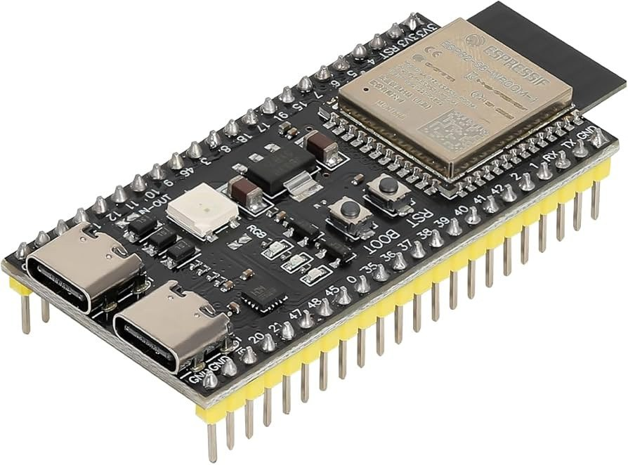
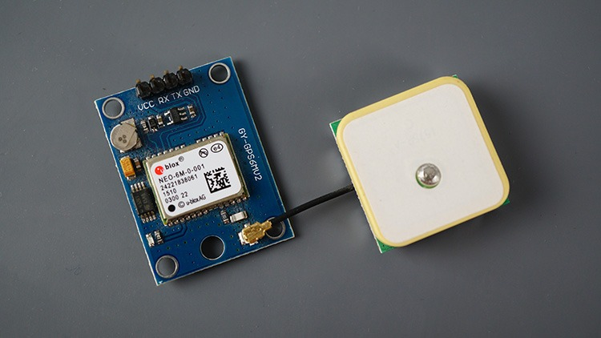
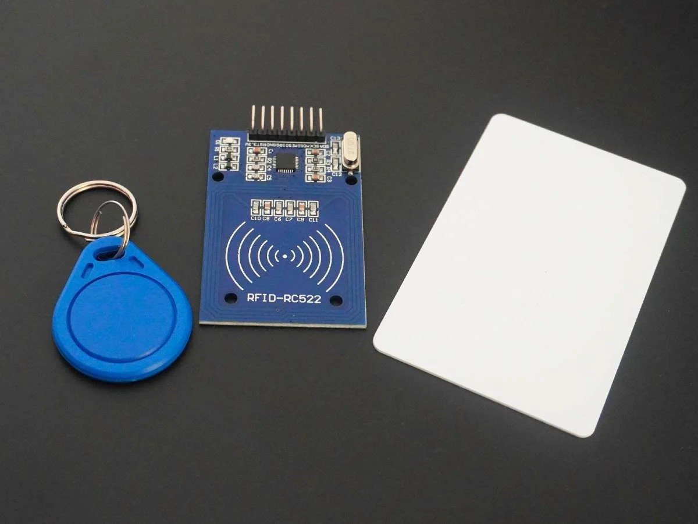

# 🧭 Tracking and Inventory Management System (TIM Project)

A Django-based web application for managing real-time tracking and inventory, Receiving data from ESP32, integrated with Redis for caching and MQTT for IoT messaging.

---
## 🔧 Hardware Setup

### 1. 📍 GPS-Based Vehicle Tracker (ESP32 + GPS)

**Components Needed:**

- 1 × ESP32-S3 Development Board
     
- 1 × GPS Module (e.g., NEO-6M)
    
- Jumper wires  
- Power supply (e.g., USB or battery)

**Wiring Guide (ESP32 ↔ GPS):**

| GPS Module Pin | ESP32-S3 Pin |
|----------------|-----------|
| VCC            | 3.3V      |
| GND            | GND       |
| TX             | GPIO 16   |
| RX             | GPIO 17   |

> ⚠️ Make sure the GPS module operates at 3.3V logic. Some modules may need a logic level shifter.

**Functionality:**

- The ESP32 reads GPS data via UART.
- It sends real-time coordinates to MQTT Broker.

---

### 2. 📦 RFID Product Tag Scanner (ESP32 + RFID)

**Components Needed:**

- 1 × ESP32-S3 Development Board 
- 1 × MFRC522 RFID Reader Module
  
- RFID Tags (e.g., MIFARE)  
- Jumper wires  
- Power supply

**Wiring Guide (ESP32 ↔ MFRC522):**

| MFRC522 Pin | ESP32-S3 Pin |
|-------------|-----------|
| VCC         | 3.3V      |
| GND         | GND       |
| RST         | GPIO 9    |
| SDA (SS)    | GPIO 10   |
| MOSI        | GPIO 11   |
| MISO        | GPIO 13   |
| SCK         | GPIO 12   |

> ⚠️ Use correct SPI pins or adapt if you're using a different ESP32 board layout.

**Functionality:**

- The UID is sent via MQTT to the Django backend for real-time handling.

---

### 📡 Networking Notes

- Both ESP32 boards must connect to the **same Wi-Fi network** as the Django server.
- The Django server should provide:
  - An MQTT broker (e.g., Mosquitto) accessible to all ESP32 devices.

---

## 🧪 Software Setup

### 🚀 Features

- Django 5.1
- Redis caching
- MQTT broker (Mosquitto) for real-time communication
- Jazzmin-admin interface customization
- Dockerized environment for easy setup

---

### 🛠️ Project Structure

```
TIM_DjProject/
│
├── Dockerfile                  # Docker instructions for Django app
├── docker-compose.yml          # Multi-container orchestration
├── requirements.txt            # Python dependencies
├── manage.py                   # Django management script
├── TIM_DjProject/              # Django settings
├── tracking/                   # Tracking app
├── inventory/                  # Inventory app
├── users/                      # User management
├── dashboard/                  # UI and analytics
├── test/                       # Test script and some GPS dataset to work with
├── custom_jazzmin_templates/   # Custom Jazzmin base.html to use in the project
└── mosquitto/
    └── config/
        └── mosquitto.conf      # MQTT broker config
```

---

### 🧪 Requirements

- Docker Desktop (Windows/macOS/Linux)
- Docker Compose v2+
- Python 3.12 (inside container)

---

### 🧱 Quick Start

#### 1. clone the repository

```bash
git clone https://github.com/AnesIDAW/Tracking_and_Inventory_Management_DjProject.git
```

#### 2. Build and Start All Services

```bash
docker-compose up --build
```

This starts:
- Django app on `http://localhost:8000`
- Redis on port `6379`
- Mosquitto MQTT on port `1883`
- Websocket on `9001`

#### 3. Apply Migrations & Create Superuser

```bash
docker exec -it TIM_django_app python manage.py migrate
docker exec -it TIM_django_app python manage.py createsuperuser
```

#### 4. Access the Admin Interface

Go to [http://localhost:8000/admin](http://localhost:8000/admin)

---

### 📡 MQTT Test Hint

You can publish test messages using [MQTT Explorer](https://mqtt-explorer.com/) or `mosquitto_pub`:

```powershell
mosquitto_pub -h localhost -t test/topic -m "hello from host"
```

### GPS tracking Simulation in the Staff dashboard

You can use `test/GPS_send_test.py` to simulate vehicles tracking in the dashboard

```powershell
python .\test\GPS_send_test.py
```

### 🛡️ Rights & Declaration

This project is developed and maintained as part of a **startup initiative** focused on innovative solutions for real-time tracking and inventory management using IoT and containerization technologies.

All rights to the design, source code, and underlying intellectual property are reserved by the creator. Unauthorized reproduction, distribution, or commercial use of any part of this software is strictly prohibited without prior written permission.

> **© TIM Project By Naimi Anes and Brahmi Essadek, 2025. All Rights Reserved.**

This project is currently in active development and represents proprietary work intended for future commercial deployment and potential investor partnerships.

For licensing inquiries, collaboration proposals, or startup engagement, please contact:

**anessnaimi29@gmail.com**
or
**brahmimouhammedessadek@gmail.com**
